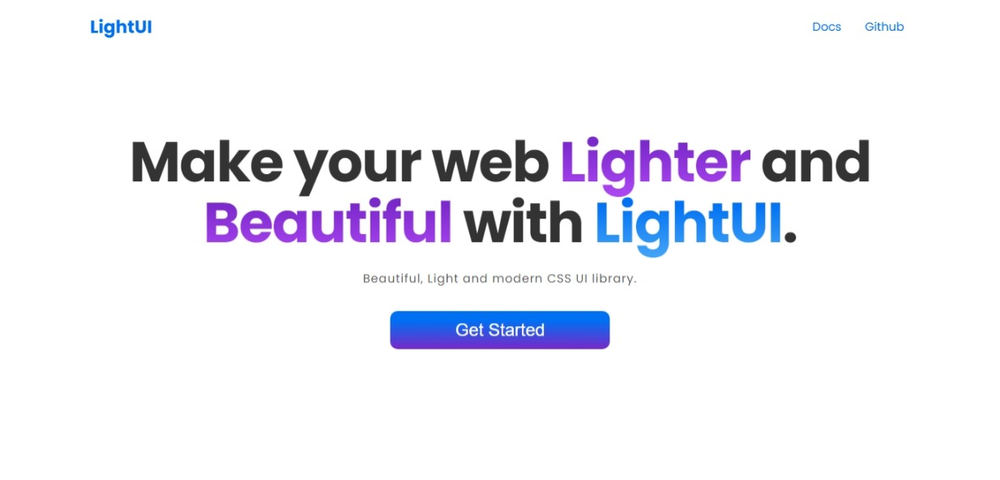

# Light UI

A CSS component Library. You can build beuatiful UI in your website by just using this Library.
It is easy to use and begineer friendly. If you are new to CSS than its your pickachu!.



## TLDR

If you want see the demo and don't want to read this readme file.
Then I have something for you.


***DEMO LINK*** ⇒
<https://lightt-ui.netlify.app/>

### Documentation

Visit <https://lightt-ui.netlify.app/> to view the full documentation.

## Quick Start

1. Installation: Inside your ```HTML``` directory, install ```NextUI``` by using either of the following:

- You can use the following link in your    ```HTML``` head.

```html
 <link 
        rel="stylesheet" 
        href="https://lightt-ui.netlify.app/lightui.css"
    /> 
```

- You can also import in your ```CSS``` file.

```CSS
   @import url("https://lightt-ui.netlify.app/lightui.css");
```

### Components and Feature

- [Avatar](#avatar)
- [Alert](#alert)
- [Button](#button)
- [Badge](#badge)
- [Card](#card)
- [Image](#image)
- [Input](#input)
- [Typography](#typography)
- [Toast](#toast)
- [List](#list)

---

### Avatar

You can use this link to see the demo => <https://lightt-ui.netlify.app/components/avatar.html>

 You can use the following type of ```Avatar```

- Profile Avatar
- Squared Profile Avatar
 Avatar comes in 5 sizes with ```xs sm md lg``` and ```xl```.

### Alert

You can use this link to see the demo => <https://lightt-ui.netlify.app/components/Alert.html>

 You can use the following type of ```Alert```

- Basic Alert
- Outline Alert

### Button

You can use this link to see the demo => <https://lightt-ui.netlify.app/components/button.html>

 You can use the following type of ```Button```

- Defualt Button
- Contained Button
- Outline Button
- Icon Button
- Link Button

### Badge

You can use this link to see the demo => <https://lightt-ui.netlify.app/components/badge.html>

 You can use the following type of ```Badge```

- Avatar Badge
- Number Badge

### Card

You can use this link to see the demo => <https://lightt-ui.netlify.app/components/card.html>

 You can use the following type of ```Card```

- Basic Card
- Card with CTA
- Product Card
- Vertical Product
- Horizontal Product Card
- Stock Out Product Card

### Image

You can use this link to see the demo => <https://lightt-ui.netlify.app/components/image.html>

 You can use the following type of ```Image```

- Round Image

- Responsive Image

### Input

You can use this link to see the demo => <https://lightt-ui.netlify.app/components/input.html>

 You can use the following type of ```Input```

- Label Input

- Text Area Input

### Typography

You can use this link to see the demo => <https://lightt-ui.netlify.app/components/Text.html>

 You can use the following type of ```Typography```

- Headings
- Text Align

### Toast

You can use this link to see the demo => <https://lightt-ui.netlify.app/components/toast.html>

 You can use the following type of ```Toast``` and you can use it as snackbar or notification .

- Basic toast

### List

You can use this link to see the demo => <https://lightt-ui.netlify.app/components/list.html>

 You can use the following type of ```List```

- simple List
- Stacked List
- Select List or Checkbox List

### Navigation

LightUI contain simple Desktop Navigation

- Simple Navigation

### Modal

LightUI contain simple Modal Too Which you can use in desktop.

### Rating

LightUI contain simplet Rating so user can use it.

### Grid

LightUI contain simple three colum grid.
